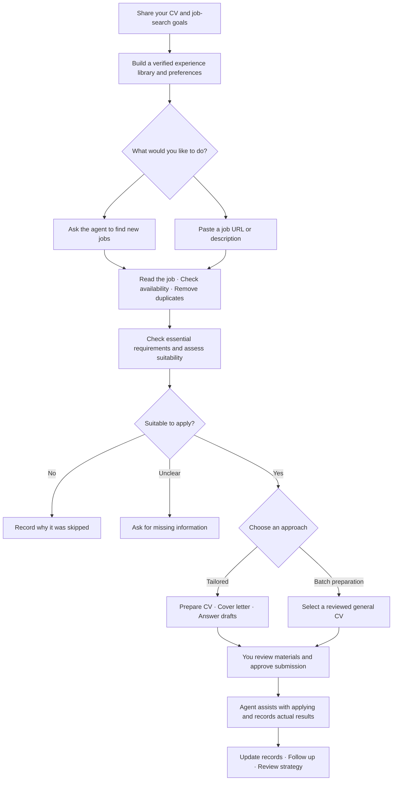

# Useless LinkedIn

**Let an AI agent find suitable jobs and handle the repetitive parts of applying.**

[中文](README.md) · [Technical guide (Chinese)](docs/技术配置指南.md) · [Privacy](PRIVACY.md)

Useless LinkedIn is an **AI agent job-search workflow / Skill**. Bring your CV and career goals; your agent helps discover vacancies, check requirements, prepare CVs and cover letters, and keep track of applications. Tell it what you need in everyday language—no scripting required.

It is a skill pack rather than a separate website or a LinkedIn browser extension. The included search configuration focuses on **France and alternance (work-study apprenticeships)** across several job boards. Other regions require search adjustments.

## What problems does it solve?

| Your problem | How the workflow helps |
|---|---|
| Switching between job boards every day | Searches public vacancies using your role, location and preferences, then builds a shortlist. |
| Discovering that jobs are closed, duplicated or unsuitable | Checks availability, application history and essential requirements; explains recommendations. |
| Rewriting your CV and cover letter for every company | Uses your confirmed experience to draft tailored documents and application answers. |
| Preparing many applications without losing control | Screens batches of jobs, selects reviewed CVs and assists with application forms. |
| Forgetting where you applied or when to follow up | Organizes statuses, next actions and follow-up suggestions, and helps review results. |

**Batch automation means finding, screening and preparing applications, with assistance submitting them.** Final submission requires your explicit approval. Login or verification steps may need your help. Installing the skill does not create an always-on service, and prepared applications are never counted as submitted.

## How does it work?



You can request just one step: “Only assess this job” or “Draft the cover letter first; do not apply yet.”

## First time? Follow these 4 steps

### 1. Choose an AI agent that can work with local files

Start with **the Codex desktop app**: install it, sign in, and create or open a dedicated job-search folder. This folder will hold your personal information and application materials.

An agent here means an AI assistant that can read files, install skills and use web tools. A chat-only website without local file access cannot directly run this workflow. Other local agent platforms can use the download option below, but installation and browsing capabilities differ.

### 2. Ask your agent to install the skill

In Codex with skill installation available, paste:

```text
Please install the Skill from the root of this GitHub repository:
https://github.com/ziyuan-404/Useless-LinkedIn
Use useless-linkedin as the installed skill name.
Use the platform's skill installer and retain the entire skill pack and resources.
Tell me whether I need to reopen the conversation to use it.
```

After installation, start a new turn or reopen the conversation as your agent advises. Invoke it with `$useless-linkedin` or ask it to use the Useless LinkedIn job-search skill.

**No skill installer available?** Click the green **Code → Download ZIP** button on this page. Extract it into a new folder, open that folder in an agent with local file access, and send:

```text
Read SKILL.md at the root of this folder and follow the Useless LinkedIn workflow.
Check the environment first, then help me initialize a separate job-search workspace.
```

This delegates installation and setup to your agent. There is currently no dedicated one-click installer button. You do not need to type technical commands yourself; ask the agent to explain any manual steps one at a time.

### 3. Share your CV and configure your workflow

Attach your own Word or PDF CV, then paste the following. Replace brackets with your details; say “unsure” where necessary.

```text
Use $useless-linkedin to set up my job-search workflow from scratch.
My job-search workspace is: [folder path]. My CV is attached.

Target roles: [for example, Python developer or data analyst].
Target locations: [cities or countries].
Contract type: [internship / alternance / permanent employment].
Earliest start date: [date].
Languages, commute limits, school schedule and other constraints: [your details].

Check the environment and available capabilities. Copy the skill's public tools,
rule templates and blank dashboard into this workspace without overwriting
existing files or my original CV. Store personal facts only in this workspace,
never in the skill installation folder.
Check dependencies, install what you can, and guide me through any manual steps.

Import my CV and organize education, work experience, projects, skills and contacts.
Ask about conflicting dates or qualifications; do not invent missing information.
Help configure searches, CV and cover-letter templates, application rules and records.
Show me the facts summary and document previews for approval before using them.
Finish by checking whether we can start searching and listing unavailable features.
Do not submit applications or send messages yet.
```

Your agent may ask several questions to clarify your criteria and verify your experience. You do not have to create profile files or edit configuration formats yourself.

Excel updates depend on spreadsheet tooling provided by the platform. If unavailable, ask your agent to maintain the job list and an application summary, and explain that limitation. Full requirements are in the [technical guide (Chinese)](docs/技术配置指南.md).

### 4. Try one job first

Start small to check that the screening and materials fit your needs:

```text
Use $useless-linkedin to assess this job: [URL or full job description].
Explain whether it suits me, which requirements I do not meet, and what needs checking.
If suitable, prepare a CV, cover letter and drafts for common application questions.
Show me the final materials; do not submit yet.
```

Once the agent can explain its recommendation, produce accurate documents without placeholders, and save a record, you can process batches. If it cannot read the full job description, it should identify the gap rather than guess.

## Configure documents and workflow in everyday language

You can change your preferences whenever you like, without reinstalling the skill.

### Configure your CV

```text
Use French, a clean one-page layout, and emphasize Python and backend projects.
Verify my experience first and keep dates and education status accurate.
Create a general developer CV and a data-oriented version.
Export previews for my review, then add approved versions to my batch-application CV pool.
```

### Configure your cover letter

```text
Write in French, within one page, in a natural and specific tone.
Connect the job's needs to my real projects, without exaggerating or using generic filler.
Show me an editable starting template, then tailor it to each company.
```

### Configure search and application strategy

```text
Prioritize Python developer alternance positions in Paris and within commuting distance.
Search WTTJ, HelloWork, Indeed France, LinkedIn and La Bonne Alternance.
Exclude senior and freelance roles and jobs clearly incompatible with my qualifications.
Tailor materials for strong matches; use reviewed general CVs for other eligible jobs.
When I start the workflow each day, show me 10 new jobs with recommendation reasons.
Do not prepare duplicate applications for jobs I have already applied to.
Prepare the batch first; assist with submitting only after I review and approve it.
```

“Each day” describes your routine when you start the workflow. Automatic scheduling requires separate platform setup; installing the skill does not create a scheduled task. Job boards may require login or restrict access; your agent will use available tools or ask for your help.

## Everyday requests

- **Find jobs:** “Find 10 new jobs that meet my criteria and rank them.”
- **Assess a job:** “Is this URL worth applying to? Check hard requirements and my history first.”
- **Prepare a batch:** “Screen these jobs and select my reviewed CVs for suitable positions.”
- **Tailor materials:** “Customize my CV and cover letter for this job and show final previews.”
- **Follow up:** “List unanswered applications and draft follow-up messages.”
- **Review strategy:** “Review recent results and suggest improvements to my targeting or materials.”

## A few things to know

- Use genuine experience. The agent must not invent qualifications, skills, permits or achievements.
- Keep original CVs; save tailored versions separately. Do not publish personal data to this repository.
- Your AI platform may process the information you share. Check its data policy; local storage does not mean fully offline processing.
- Messages and applications must remain within your explicit authorization. No success evidence means no submitted status.
- This workflow improves organization and efficiency; it does not guarantee employment or replace your confirmation of personal facts.

More: [Privacy](PRIVACY.md) · [Technical setup and troubleshooting (Chinese)](docs/技术配置指南.md)

## License and acknowledgments

Project-owned adaptations use the [MIT license](LICENSE). The project references and reuses resources from ApplyPilot, Personal Career OS, resume-builder and career-ops. Third-party modules, fonts and templates retain their licenses. See [third-party notices](THIRD_PARTY_NOTICES.md).
