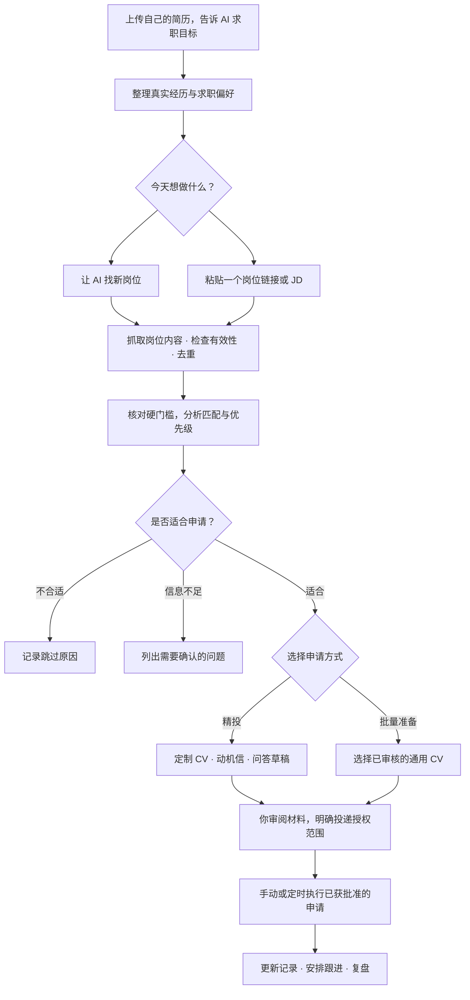

# Useless LinkedIn

**让 AI 帮你找合适的工作，把重复的求职操作交给一个工作流。**

[English](README.en.md) · [详细技术配置](docs/技术配置指南.md) · [隐私说明](PRIVACY.md)

Useless LinkedIn 是面向法国求职与 alternance 的 Skill：一个入口、多个有状态工作流，复用领域模块和确定性工具。你提供真实经历与求职目标，Agent 找岗位、筛选要求、准备材料、在授权范围内投递并整理结果。你可以用中文告诉它要做什么，不需要自己写脚本。

它不是一个需要单独登录的网站，也不是 LinkedIn 插件。当前岗位搜索配置主要面向**法国求职与 alternance（学徒制 / 工学交替）**，支持多个招聘网站；其他地区需要调整搜索配置。

系统按四层工作：**Career Memory** 保存可追溯经历，**Job Intelligence** 发现并评估岗位，**Application Engine** 准备材料并在授权范围内投递，**Pipeline** 跟踪结果并把有证据的复盘结论带入下一轮。执行顺序见 `workflows/`，判断规则见 `modules/`。

## 这个 Skill 的核心优点

- **四层找岗位，不只依赖一个网站或一种抓取方式。** 按 API → 网页直接读取 → Playwright 浏览器 → Agent 网页搜索逐层回退，覆盖 WTTJ、HelloWork、Indeed France、LinkedIn 和 La Bonne Alternance。后两层取决于 Agent 和环境的工具能力，网站受限时不会假装抓取成功。
- **先确认岗位还在，再决定是否投。** 对岗位做存活检测、申请历史查重与硬门槛检查，减少在过期、重复和明显不符合条件的岗位上浪费时间。
- **A–G 分析，让推荐有理由。** 从岗位概况、经历证据、申请策略、薪酬与需求、材料定制、面试准备、真实性风险七个方面分析，给出可解释的 1–5 级优先级；H 部分另行准备申请回答草稿，不编造精确匹配百分比。
- **一份真实经历库，复用到所有申请。** 导入自己的简历并核对事实后，CV、动机信和问答都使用同一份经历依据，减少日期、学历和项目表述前后不一致。
- **精投和批量准备放在同一个流程里。** 值得重点争取的岗位定制材料，其余合适岗位选择已审核的通用 CV；统一生成 PDF、检查版面和文件体积，避免每家公司重新拼脚本。
- **从找岗位到跟进形成闭环。** 岗位列表、材料、申请记录与跟进建议连接起来，区分“已发现、已准备、已提交”，让你知道下一步该做什么。

### 从四个开源项目借鉴了什么？

| 项目 | 借鉴的好设计 | 在这里怎么用 |
|---|---|---|
| [ApplyPilot](https://github.com/yvonnehe772/applypilot) | Agent 带着用户完成配置、精投/海投分流、申请卡点与提交证据 | 用自然语言配置规则，协助填写申请，记录真实结果。 |
| [Personal Career OS](https://github.com/Pluto-Mo/personal-career-os) | 统一经历库、经历深挖、从 JD 到材料的工作流 | 把简历整理成可复用事实，持续补充经历，不建立多份互相冲突的档案。 |
| [resume-builder](https://github.com/StoneLL1/resume-builder) | 简历事实追溯、写作与排版分离、模板和渲染预览 | 先核对内容，再生成和审阅材料，保留原始简历。 |
| [career-ops](https://github.com/career-ops-hq/career-ops) | scan、auto-pipeline、tracker，岗位存活、查重、Knock-out、A–G 分析与 H 申请回答 | 参考工作流并以本项目共享工具重新实现，串起岗位发现、评估、材料准备和追踪。 |

这是把这些设计组合、适配成**一个 Skill 入口**，并非安装四个独立技能。四层抓取是本项目整合后的回退流程；不是所有功能都由某一个上游项目直接提供。版本与许可见 [第三方归属](THIRD_PARTY_NOTICES.md)。

## 它能帮你解决哪些问题？

| 你的困扰 | 工作流怎么帮你 |
|---|---|
| 每天在几个网站之间切换，找不到合适岗位 | 按你的方向、地点和条件寻找公开岗位，整理成候选列表。 |
| 打开很多链接才发现已关闭、重复或不符合要求 | 检查岗位有效性、重复记录与硬性门槛，说明推荐或跳过的理由。 |
| 每家公司都要重新改简历、写动机信 | 从你确认的真实经历出发，准备针对岗位的 CV、动机信和申请问答草稿。 |
| 想批量投递，但担心发错简历或盲目海投 | 批量筛选岗位，选择已审核的通用简历，准备申请并协助填写。 |
| 投完就忘了，跟进全靠记忆 | 整理申请状态、待办与跟进建议，帮助复盘求职效果。 |

**目标是配置好后，通过定时任务执行自动化求职与投递。** 先完成经历库、材料、筛选规则、账号登录和提交授权，再由 Codex 等 Agent 平台按计划启动：找岗位 → 筛选 → 准备材料 → 在你明确批准的范围内投递 → 更新记录。需要审阅的新材料、验证码或未知关键条件会进入待处理队列；只有看到成功证据才记为已投递。

## 整个流程怎么运行？



你随时可以只做其中一步，例如“只帮我分析岗位”或“先写动机信，暂时不投”。

## 第一次使用：跟着这 4 步走

### 1. 准备一个能操作本地文件的 AI Agent

建议从 **Codex 桌面版**开始：安装并登录，创建或打开一个专门的求职文件夹。这个文件夹以后保存你的个人资料和申请材料。

这里的 Agent 指能读取文件、安装技能并使用网页工具的 AI 助手。仅能聊天、不能操作本地文件的网页聊天窗口，无法直接运行这套工作流。其他 Agent 平台可以使用下方的下载方式，但安装入口和网页能力可能不同。

### 2. 把技能交给 Agent 安装

在支持技能安装的 Codex 对话中，复制这一段：

```text
请安装 GitHub 仓库 https://github.com/ziyuan-404/Useless-LinkedIn
根目录的 Skill，安装名称设为 useless-linkedin。
请使用平台的技能安装功能，保留整个技能包及其附带资源。
安装后告诉我是否需要重新打开对话，确保能调用这个技能。
```

安装完成后，按 Agent 提示开启新一轮对话或重新打开会话。以后使用 `$useless-linkedin` 或明确说“使用 Useless LinkedIn 求职技能”即可。

**找不到技能安装功能？** 在本页点击绿色 **Code → Download ZIP**，解压到一个新文件夹，用支持本地文件的 Agent 打开它，再发送：

```text
请读取这个文件夹根目录的 SKILL.md，按 Useless LinkedIn 的规则工作。
请先检查环境，再帮我初始化一个独立的求职工作区。
```

这是把安装和配置交给 Agent 的快捷方式；本项目目前没有独立的“一键安装”按钮。你不需要手动输入技术命令，遇到需要你操作的步骤，让 Agent 一次说明一步。

### 3. 上传简历，让 AI 帮你完成首次配置

把你自己的 Word 或 PDF 简历提供给 Agent，再发送下面这段。方括号中的内容换成自己的情况，不确定的部分直接写“不确定”。

```text
使用 $useless-linkedin，帮我从零初始化求职工作流。
我的求职文件夹是：[选择的文件夹路径]。我的简历已附上。

我想找：[岗位方向，例如 Python 开发 / 数据分析]。
目标地区：[城市或国家]。
合同类型：[实习 / alternance / 全职]。
最早开始时间：[时间]。
语言水平、通勤范围、学校节奏及其他限制：[你的情况]。

请先检查环境与可用功能，运行 `useless-linkedin init --workspace`，把空白规则、模板和
看板初始化到这个求职工作区；工具留在技能安装目录，不要覆盖已有文件或原始简历。
只在这个工作区建立个人经历库，不把个人资料写回技能安装目录。
检查缺少的依赖，能安装的帮我安装，需要我操作的逐步告诉我。

请导入简历，整理教育、实习、项目、技能和联系方式。
日期或学历有冲突时问我，缺失的信息不要编造。
帮我配置搜索条件、CV 和动机信模板、投递规则与申请记录。
先给我看事实摘要和材料预览，由我确认后再用于申请。
最后检查是否可以开始找岗位，并列出暂时不可用的功能。
暂时不要提交申请或发送消息。
```

Agent 可能会问你几轮问题，这是在补齐求职条件和核对经历。你不需要自己创建资料文件或修改配置格式。

初始化后双击工作区的 `打开Dashboard.cmd` 即可在浏览器中使用本地申请看板。历史 Excel 可通过一次性导入命令迁移，原件应另存保留；完整技术要求见 [技术配置指南](docs/技术配置指南.md)。

### 4. 先跑一个小任务

建议先从一个岗位开始，确认材料和筛选方式符合你的预期：

```text
使用 $useless-linkedin，分析这个岗位：[粘贴链接或完整 JD]。
用中文说明是否适合我、哪些条件不满足、哪些信息还需要确认。
如果适合，准备 CV、动机信和常见申请问题的回答草稿。
给我查看最终材料，暂时不要提交申请。
```

当 Agent 能解释匹配理由、生成没有占位文字且事实准确的材料，并保存记录，你就可以开始批量处理。看不到完整岗位内容时，它应说明缺失信息，而不是猜测。

## 用自然语言配置自己的材料和工作流

你可以随时提出修改，不必重新安装技能。

### 配置 CV

```text
我的简历用法语、一页、简洁排版，突出 Python 和后端项目。
请先核对我的经历，保留真实日期和学历状态。
给我两个版本：一个通用开发岗版本，一个数据方向版本。
导出预览让我审核，确认之后再加入批量申请用的简历池。
```

### 配置动机信

```text
动机信用法语，控制在一页，语气自然、具体。
围绕岗位需求和我的真实项目写，不要夸大经验或堆套话。
先给我一份可调整的模板，以后针对每家公司改写。
```

### 配置岗位搜索和投递策略

```text
以后优先找巴黎及可通勤地区的 Python 开发 alternance。
从 WTTJ、HelloWork、Indeed France、LinkedIn 和 La Bonne Alternance 找岗位。
排除 senior、freelance 和明显不符合我学历条件的岗位。
匹配度高的做精投，其他符合硬条件的用已审核的通用 CV。
每天我启动时先给我 10 个新岗位，说明推荐理由，不重复准备已申请岗位。
先批量准备，等我审阅并批准后再协助提交。
```

配置完成后，你可以把这套流程设为定时任务，按天或按工作日自动执行。安装 Skill 本身不会创建任务，具体设置见下方。招聘网站可能有登录墙或访问限制，无法继续的步骤会保留记录并请你处理。

## 配置好以后：用 Codex 定时执行自动化投递

先手动完成一次完整流程，确认搜索结果、材料和记录正确，再设定时任务。这样你不必每天重复发送同一段指令。

1. 在 Codex 桌面版打开你的**个人求职工作区**，确认技能、资料、材料和网页工具可以使用。
2. 在当前求职对话中，请 Codex 创建定时自动化，说明时间、时区、岗位条件、每次上限和提交授权；核对任务卡片后启用。
3. 在侧栏的 **Scheduled / 定时任务**入口查看、修改、暂停任务和检查运行结果。部分版本可能显示为 **Automations / 自动化**，以实际界面为准。
4. 本地任务运行时，保持电脑开机、联网且应用运行，工作区文件和账号登录状态可用。定时任务仍使用平台的工具与权限。

可以直接复制这段，再修改时间和上限：

```text
请为当前求职工作流创建定时自动化：
每个工作日早上 9 点运行，时区 Europe/Paris，继续使用当前对话
和我的个人求职工作区。使用 $useless-linkedin。

每次按我的规则找最多 10 个新岗位，检查存活、重复和硬门槛，
完成 A–G 分析，准备合适岗位的材料和申请回答。

对于我已经审阅材料并明确批准提交的申请，按批准的岗位、材料
和数量范围执行自动投递；不要仅凭“适合”就推定获得提交授权。
新生成的材料或超出授权的申请进入待审阅队列。
验证码、登录失效或未知关键身份条件进入待处理队列，继续处理
其他可以完成的岗位。不要编造回答、重复投递或发送未授权消息。

根据实际成功证据更新申请记录，每次结束汇总已提交、待审阅、
受阻和下一步。先试运行一次，供我检查后再启用定时执行。
```

**从批量准备逐步切换到自动投递：** 先审核通用 CV 和筛选规则，再审阅首批申请并明确批准。后续任务可以定时执行这些已获批准的申请；新定制的材料仍需按工作流审阅。定时执行能力取决于平台及招聘网站，不代表所有网站都能全程无人介入。

本地求职资料应使用本地工作区任务；网页端任务不能直接读取电脑上的文件夹。任务可用性和界面以当前版本为准，参见 [OpenAI 官方定时任务说明](https://learn.chatgpt.com/docs/automations?surface=app)。

## 日常可以直接这样说

- **找岗位：**“帮我找 10 个符合条件的新岗位，按优先级排序。”
- **评估岗位：**“这个链接值得投吗？先检查硬条件和申请历史。”
- **准备海投：**“把这批岗位筛选一遍，为合适的岗位选择我审核过的 CV。”
- **精投：**“为这个岗位定制简历和动机信，给我最终预览。”
- **跟进：**“整理已申请但未回复的岗位，写跟进草稿。”
- **复盘：**“看看最近的申请结果，建议我调整岗位方向或材料。”

## 开始前需要知道的几件事

- 只写真实经历，AI 不应替你编造学历、技能、签证或成果。
- 原始简历保留，定制材料另存；个人资料不上传到本项目仓库。
- AI 平台可能会处理你提供的资料，使用前请了解平台的数据政策；本地存储不等于完全离线。
- 邮件、联系人消息和真实申请按你的明确授权执行；没有成功证据，不记为已提交。
- 这是帮助你提高求职效率的工具，不保证录用，也不能代替你确认个人情况。

更多说明：[隐私边界](PRIVACY.md) · [技术配置与故障排查](docs/技术配置指南.md)

## 开源与致谢

项目自有改编内容采用 [MIT](LICENSE)。参考并复用了 ApplyPilot、Personal Career OS、resume-builder、career-ops 等资源；第三方模块、字体和模板保留各自许可。详见 [第三方归属](THIRD_PARTY_NOTICES.md)。
