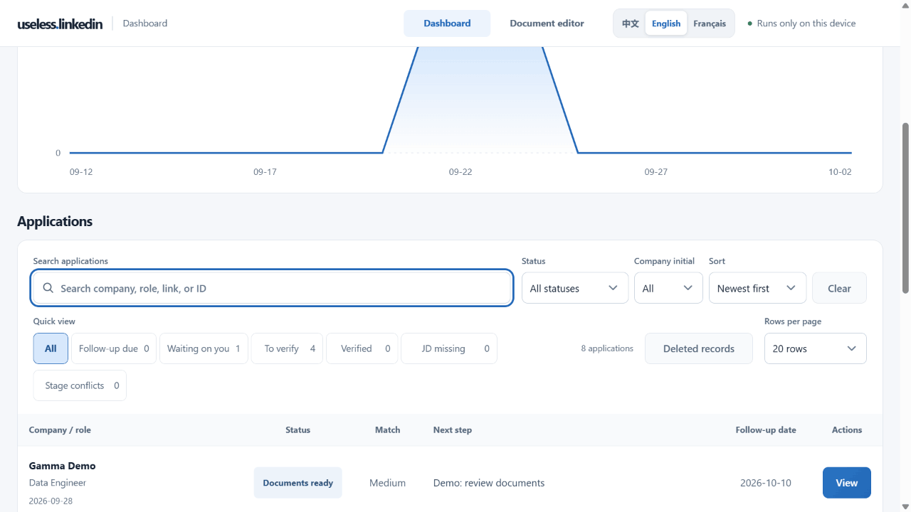
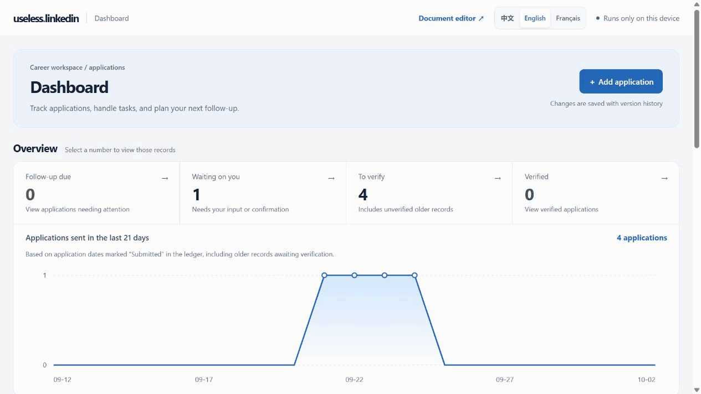
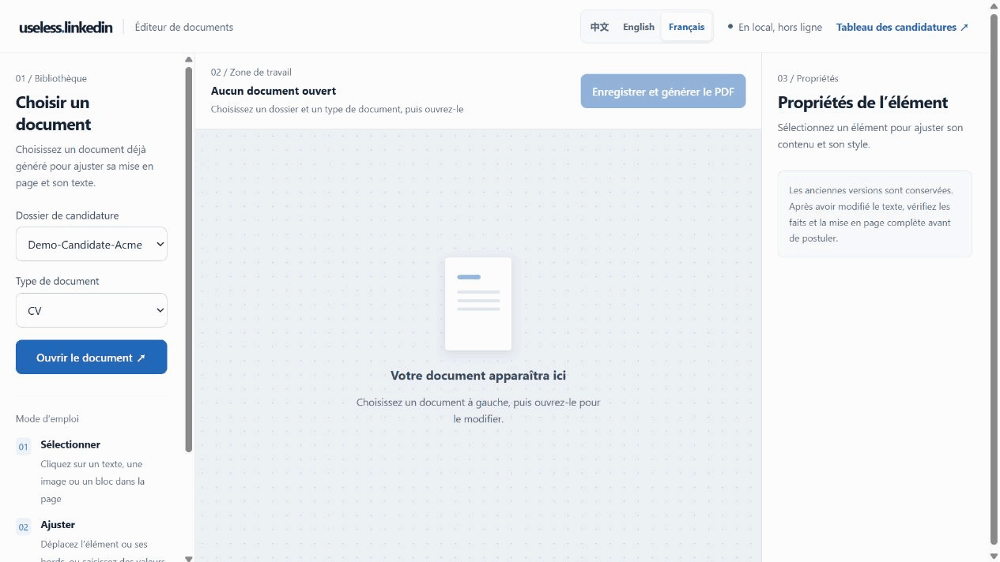

# Useless LinkedIn

**法国求职 Skill：用自然语言找岗位、准备材料、投递和跟进。**

中文 · [English](README.en.md) · [Français](README.fr.md)

提供自己的简历和求职目标，Agent 会检查岗位有效性、重复记录与硬门槛，准备 CV、动机信和申请问答，在你的授权范围内提交，并更新本地投递看板。岗位方向、合同类型、地区和开始时间均按你的条件配置。

使用流程：**检查待办 → 找岗位或读取 JD → 筛选 → 准备并审查材料 → 投递并核验凭证 → 更新看板与跟进日期**。你也可以只做其中一步。

## 1. 安装和首次配置

使用能操作本地文件和网页的 Agent，例如 Codex 桌面版。打开一个专用求职文件夹，在对话中发送：

```text
请从 https://github.com/ziyuan-404/Useless-LinkedIn 的 Test 分支
安装根目录的 Skill，名称设为 useless-linkedin，保留整个技能包和 INSTALL.md。
安装后告诉我是否需要重新打开对话。
```

没有技能安装入口时，选择 GitHub 的 **Test 分支 → Code → Download ZIP**，解压后让 Agent 读取根目录 `SKILL.md`。

上传自己的 Word 或 PDF 简历，再发送以下内容，把方括号替换成实际条件：

```text
使用 $useless-linkedin，按 SKILL.md 和 INSTALL.md 完成首次配置。
个人求职工作区：[独立文件夹路径，不放在 Skill 安装目录内]。
我的简历已附上。
目标岗位：[方向]；地点：[法国城市、远程或通勤范围]。
合同类型：[你的选择]；开始时间：[日期]。
语言水平、学历、工作许可及其他限制：[实际情况，不确定就注明]。

请自动安装依赖、初始化工作区、配置搜索条件与材料模板，建立唯一的
真实经历库，并检查投递看板和材料编辑器能否启动。
保留原始简历和已有资料，缺失或冲突的事实向我确认。
先用一个岗位验证筛选、材料生成与记录流程，暂时不要投递或发送消息。
```

**看板由 Agent 自动配置。** 按 [INSTALL.md](INSTALL.md)，Agent 检查 Node.js 24+、Python 3.10+，安装依赖并运行安装器，建立空白申请台账和启动文件。无需手动创建数据库或设置环境变量；系统管理员授权提示仍需你处理。下载 Skill 本身不会执行安装，也不会自动创建定时任务。

工具留在 Skill 安装目录；简历、经历库、申请记录和材料放在独立个人工作区。安装后仍需根据你的真实材料建立档案。

## 2. 日常怎么用

在已配置的工作区中调用 `$useless-linkedin`，直接说明任务：

| 想做什么 | 可以这样说 |
|---|---|
| 找岗位 | 按我的条件找 10 个新的法国岗位，查重并按优先级排序。 |
| 分析岗位 | 分析这个链接或 JD，检查硬门槛、经历依据和申请历史，说明推荐理由。 |
| 准备材料 | 为这个岗位定制 CV、动机信和问答，给我最终 PDF 预览。 |
| 批量准备 | 筛选这批岗位，为符合条件的岗位选择已审核的通用 CV。 |
| 投递 | 在我已记录的授权范围内，检查最终材料后投递，保存成功凭证并更新看板。 |
| 跟进与复盘 | 检查到期跟进和提交待核验记录，整理下一步，并起草跟进消息。 |

修改搜索条件或材料风格也直接告诉 Agent，例如：“以后优先找里昂的数据分析岗位”“CV 用法语、一页，突出真实项目”。无需重新安装。

没有完整 JD 或关键事实时，Agent 应记录待确认项。**点击提交或上传文件不等于投递成功**；只有核实成功页、确认邮件或平台状态后，才记录已提交。邮件和联系人消息按各自授权执行，草稿不代表已发送。

## 3. 投递看板（Dashboard）

### 启动与配置

安装完成后，在个人工作区双击：

- **Windows：** `打开Dashboard.cmd`
- **macOS：** `打开Dashboard.command`（由 Agent 在 Mac 上运行安装器生成）

启动窗口会同时启动并监测看板和材料编辑器，并打开看板。保持窗口运行；从看板顶部进入编辑器。

默认地址：看板 `http://127.0.0.1:8765/`，编辑器 `http://127.0.0.1:8766/`。仅监听本机，无需注册账号；台账在个人工作区的 `个人资料/dashboard/applications.sqlite` 中。

页面打不开、Skill 移动或旧 Excel 需要迁移时，可以直接说：

```text
请按 INSTALL.md 和 Dashboard 工作流检查当前工作区，修复依赖、
启动路径或端口问题；需要时重跑安装器补齐缺失文件，保留已有资料和台账。
如果我提供了历史 Excel，请只读导入并核对，保留原件。
```

### 页面操作

1. **看概览。** 点击到期跟进、待用户处理、提交待核验或已核验的数字，查看对应记录。最近 21 天趋势保持展开；历史已提交记录可能尚未核验，与已核验提交分开统计。
2. **找记录。** 搜索公司、岗位、链接或 ID，按状态、公司首字母筛选和排序。快速查看可定位 JD 待补全或阶段冲突；右侧选择每页 10、20 或 50 条。
3. **新增或编辑。** 填写岗位、执行状态、匹配度、下一步和跟进日期。阶段使用复选框，最多选一个；修改保留历史，未保存时离开会提示。
4. **核验凭证。** 填写证据说明不会自动变成“凭证已核验”，仍需检查成功凭证原件。



两个界面都可切换 **中文 / English / Français**，刷新后保留选择。界面语言不会翻译你填写的申请内容或材料正文。



字段口径和维护规则见 [Dashboard 工作流](references/dashboard-workflow.md)。

## 4. 材料编辑器

用于修改 Agent 已生成的岗位 CV 和动机信。先让 Agent 准备材料，它们应位于个人工作区 `个人资料/CV/` 的岗位目录中。编辑器不会直接把任意上传的 Word 或 PDF 转成可编辑材料。

1. 从看板进入编辑器，选择岗位目录和材料类型，点击“打开材料”。
2. 单击选择组件，双击文字修改；拖动组件或边缘调整位置和尺寸。
3. 用属性面板修改文字、图片、字号、颜色、透明度和层级，检查整页是否重叠或溢出。
4. 点击“保存并生成 PDF”。成功后更新 HTML、PDF 和预览图，旧版保存在岗位目录的 `work/editor-history/`；失败时保留正式文件和当前修改。
5. 让 Agent 重新核对事实、PDF 文本与整页版面，再继续投递。修改文件会使旧的材料审查依据失效。



*以上 GIF 使用虚构公司、岗位和材料，不包含真实申请或个人简历。*

切换材料或离开时会提示未保存的修改。详细操作见 [材料编辑器工作流](references/editor-workflow.md)。

## 5. 定时执行（可选）

先跑通一次完整流程，并记录允许投递的范围，再让支持本地定时任务的 Agent 平台创建任务。例如：

```text
为当前个人求职工作区创建定时任务，每个工作日 9 点，时区 Europe/Paris。
使用 $useless-linkedin，每次按我的条件处理最多 10 个新岗位。
先处理未完成事项和到期跟进，再检查新岗位、准备并审查材料。
按已记录的投递授权执行，核实成功凭证后更新看板。
验证码、登录失效或未知关键事实只阻塞对应岗位，继续其他可处理岗位。
结束后汇总已提交、受阻和下一步；不重复申请或发送未授权消息。
```

本地任务需要电脑开机、联网，平台和工作区可用。由 Agent 核实任务是否创建、启用和运行。安装 Skill 不会自动开始投递。执行规则见 [每日循环](workflows/daily-cycle.md) 和 [无人值守方案](workflows/unattended-run.md)。

## 更多说明

- [安装指南](INSTALL.md) · [技术配置与故障排查](docs/技术配置指南.md)
- [隐私边界](PRIVACY.md)：不要发布真实简历、联系方式、申请记录或登录资料；本地存储不等于模型处理完全离线。
- [MIT 许可](LICENSE) · [第三方归属](THIRD_PARTY_NOTICES.md)：参考并复用 ApplyPilot、Personal Career OS、resume-builder 和 career-ops 的资源，第三方内容保留各自许可。
