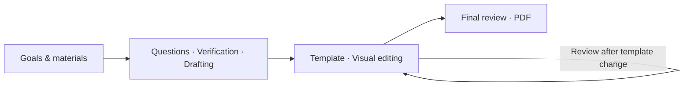

<h1 align="center">resume-builder</h1>

<p align="center">Your experience. The right questions. A resume ready to send.</p>

<p align="center">
  <a href="#screenshots"></a>
  <a href="INSTALL.md"></a>
  <a href="references/rendering-stage.md"></a>
  <a href="#licenses"></a>
</p>

<p align="center"><a href="README.md">简体中文</a> · <strong>English</strong></p>

<p align="center"><a href="#quick-start">Quick Start</a> &nbsp;·&nbsp; <a href="#whats-new">What's New</a> &nbsp;·&nbsp; <a href="#screenshots">Gallery</a> &nbsp;·&nbsp; <a href="#docs">Docs</a></p>

<p align="center">
  
</p>

**resume-builder is an Agent Skill that takes a resume from source material to an exportable PDF.** Bring an existing resume, a target role, or scattered notes. The Agent asks follow-up questions, verifies facts, drafts the content, and guides you through template selection and browser editing.

Its writing methodology is **distilled from nearly 100 highly liked resume advice posts on Xiaohongshu (Rednote)**. It supports one- to two-page Chinese or English resumes for jobs, internships, competitions, and academic admissions. A polished first draft is not a prerequisite for getting started.

<a id="whats-new"></a>

## What's New

| Capability | What you can do |
| :--- | :--- |
| **18 Chinese & English templates** | Browse nine templates per language and inspect full previews before choosing. |
| **Visual browser editing** | Click text to edit, add or remove entries and bullets, and reorder items within a section. |
| **Live Typst rendering** | Render saved changes, check actual page counts, and export consistently named PDFs. |
| **Conversation & browser workflow** | Continue content work in either interface; draft first, then refine for the selected template. |
| **Traceable facts** | Inspect sources and filter claims by confirmed, pending, blocking, or omitted status. |


<p align="center"><sub>Actual local interface · Fictional demonstration data · Automatic rendering after save</sub></p>

<a id="quick-start"></a>

## Quick Start

### 1. Ask your Agent to install

Send this to an Agent that can access local files, execute commands, and load `MODULE.md`:

```text
Fetch and follow instructions from:
https://raw.githubusercontent.com/StoneLL1/resume-builder/main/INSTALL.md
```

[INSTALL.md](INSTALL.md) is written for the Agent and covers directory discovery, installation, runtime setup, and verification. Windows and macOS bootstrap scripts are included. Node.js and XeLaTeX are not required.

### 2. Bring your materials and start a conversation

```text
Use resume-builder to create a one-page English resume for this job description.
I will provide my existing resume and additional experience. Proactively ask for
missing information and verify the facts before drafting. Once the content is
ready, open the template gallery so I can choose a layout and refine it in the browser.
```

Provide your resume, job description, and supporting materials in the conversation. The Agent opens the browser when the content is ready; you do not have to direct every step.

<a id="features"></a>

## Why resume-builder

### Better questions lead to specific content

“I contributed to a project” is a starting point. The Agent selects material for your target and typically asks **three to six questions at a time** to clarify responsibilities, challenges, and outcomes. For example:

> **You:** I helped build a campus registration system.<br>
> **The Agent follows up:** Which parts did you own? What problem did you solve? Was it deployed, used, or formally accepted?

Your answers enter the fact record before they inform the draft. Information explicitly marked as unavailable, skipped, or excluded is not repeatedly requested.

### Practical advice, turned into writing rules

The Agent must read the bundled [writing guide](references/Resume-Writing-Guide-LLM.md) before drafting. No Xiaohongshu account or access is required. Four principles guide the work:

- **Select for the target:** Prioritize relevant experience supported by evidence.
- **Show individual contributions:** Problem → personal action → outcome, beyond a list of responsibilities.
- **Evidence before metrics:** Without reliable numbers, describe deployment, adoption, acceptance, or deliverables.
- **Make claims you can explain:** Do not invent experience, inflate ownership, or claim all of a team's results.

### Content first, layout second

Draft independently of a template, then refine for the chosen layout. Changing templates triggers another review. Projects are stored separately and can be resumed after closing the browser, with a PDF as the final deliverable.

<a id="screenshots"></a>

## Templates & Screenshots

### See the layout before you choose

| Chinese · 9 templates | English · 9 templates |
| :---: | :---: |
|  |  |

Templates retain upstream layouts and fonts, with full-size previews. Harvard provides a black-and-white layout. See [screenshot provenance](assets/screenshots/README.md) for sources. The current interface, detailed writing guide, and Agent installation instructions are in Chinese; English resume content is supported.

<details>
<summary><strong>Explore all 18 templates</strong></summary>

| Language | Templates |
| :--- | :--- |
| Chinese | OrangeX4, Chi CV original / Chinese edition, Resume NG, Miku CV, Qianxi, Unique CV, Habaneraa, SweetGargamel |
| English | RenderCV Classic / ModernCV / Harvard / Ink / Opal, Basic Resume, ImpreCV, Modern CV, Index CV |

See the [template registry](assets/templates/registry.md) for pinned revisions, attribution, font requirements, and adaptation diffs. Switching gallery categories does not change content. If you select a template in another language, the Agent translates, refines, and verifies the resume.

</details>

<details>
<summary><strong>See inline editing and fact review</strong></summary>

**Inline editing** · Click a field in the preview to edit it. Bold text and links are supported; saving triggers a new render.


**Fact review** · Inspect sources and four confirmation statuses, maintained by the Agent through the conversation.


</details>

## From Source Material to PDF



When editing is complete, use **完成 (Finish)** to notify the Agent for final review, then **导出 → 导出正式 PDF (Export → Export final PDF)**. Files are named `Name-TargetRole-Phone.pdf`, with the phone portion omitted when unavailable.

<a id="docs"></a>

## Documentation

| Resource | Contents |
| :--- | :--- |
| [Installation](INSTALL.md) | Agent installation, dependencies, verification, and runner setup |
| [Skill entry point](MODULE.md) | Agent behavior and workflow routing |
| [Writing guide](references/Resume-Writing-Guide-LLM.md) | Methodology organized by role and experience type |
| [Template registry](assets/templates/registry.md) | All 18 templates, upstream sources, and licenses |
| [Data contract](references/data-contract.md) | Resume data, fact records, and project directory conventions |

<details>
<summary><strong>Project structure</strong></summary>

```text
resume-builder/
├── MODULE.md                       # Agent entry point
├── INSTALL.md                     # Agent installation workflow
├── README.md / README.en.md        # Chinese / English documentation
├── cover.png                      # Original cover artwork
├── references/                    # Writing and workflow guides
├── scripts/                       # Bootstrap, server, rendering, validation
└── assets/                        # Templates, web UI, dependencies, screenshots
```

Each resume lives in a purpose-specific directory outside the skill, containing `resume.json`, the final PDF, and a `work/` directory for source materials, the claim map, session state, and build files.

</details>

## FAQ

<details>
<summary><strong>Which Agents and platforms are supported?</strong></summary>

The Agent needs local file access, command execution, and support for `MODULE.md`. Claude Code and Codex use their configured skill directories; OpenClaw, Hermes, and other runners use their own configuration. Bootstrap scripts cover Windows and macOS; no Linux runtime manifest is currently provided. Some templates need original system fonts; see [INSTALL.md](INSTALL.md).

The editor targets desktop browsers and one- to two-page monolingual Chinese or English resumes. Mobile / tablet editing, mixed bilingual layouts, cover letters, portfolios, and long academic CVs are outside the current scope.

</details>

<details>
<summary><strong>Where is data stored? Is the entire workflow offline?</strong></summary>

Resume content and session state are stored locally. The web service listens only on `127.0.0.1`. Initial setup downloads runtimes and open fonts; templates and Typst packages are bundled. Data handling in the Agent conversation depends on your Agent and model provider. A local web interface does not make the entire AI workflow offline.

</details>

<details>
<summary><strong>What are the limits of browser editing and fact review?</strong></summary>

The Agent and editor share `resume.json`. Concurrent edits use the most recently saved content; conflicts are not automatically merged. Snapshot rollback, cross-section dragging, browser uploads, and embedded AI chat are not currently available.

The Agent drafts from confirmed facts. The browser displays claim statuses read-only; editing wording does not verify a claim. Export does not block unconfirmed claims, so factual checks remain part of the writing workflow and final review.

</details>

<a id="licenses"></a>

## Acknowledgments & License

Thanks to the Xiaohongshu contributors who shared their resume experience, and to the maintainers of the upstream templates, Typst, fonts, and icon projects.

Original project code is licensed under [MIT](LICENSE). Third-party assets retain their respective licenses; see the [template registry](assets/templates/registry.md), per-template `ATTRIBUTION.md` files, and [runtime notices](assets/runtime-NOTICES.md). The pinned OrangeX4, Chi CV Chinese edition, and Unique CV sources do not declare a standalone license and are recorded as `NOASSERTION`; the project's MIT license does not cover them.
