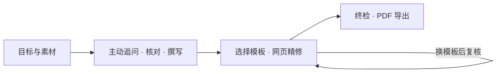

<h1 align="center">resume-builder</h1>

<p align="center">从真实经历出发，让 Agent 问到重点，写出可投递的简历。</p>

<p align="center">
  <a href="#screenshots"></a>
  <a href="INSTALL.md"></a>
  <a href="references/rendering-stage.md"></a>
  <a href="#licenses"></a>
</p>

<p align="center"><strong>简体中文</strong> · <a href="README.en.md">English</a></p>

<p align="center"><a href="#quick-start">快速开始</a> &nbsp;·&nbsp; <a href="#whats-new">What's New</a> &nbsp;·&nbsp; <a href="#screenshots">模板预览</a> &nbsp;·&nbsp; <a href="#docs">文档</a></p>

<p align="center">
  
</p>

**resume-builder 是一个从素材收集到 PDF 交付的 Agent Skill。** 你提供旧简历、目标岗位或零散经历，Agent 主动追问、核对事实、组织内容，再带你选模板、在浏览器中精修。

写作方法论**蒸馏自近百篇小红书高赞简历经验帖**，覆盖中文与英文的 1–2 页求职、实习、比赛和升学简历。你不必先学会写简历，才能开始写简历。

<a id="whats-new"></a>

## What's New

| 新能力 | 使用体验 |
| :--- | :--- |
| **18 套中英文模板** | 中文 9 套、英文 9 套；在画廊中查看完整预览，再选择版式。 |
| **浏览器可视化精修** | 点击文字编辑，增删经历与要点，在同一板块内拖拽排序。 |
| **Typst 实时排版** | 保存后重新渲染，查看实际页数，导出规范命名的 PDF。 |
| **对话与网页协作** | 内容可在 Agent 与编辑器之间继续调整；先写内容，再按模板精修。 |
| **事实追溯与核对** | 查看表述来源，筛选已确认、待确认、缺失阻塞和已省略的内容。 |


<p align="center"><sub>真实本地界面 · 虚构演示素材 · 保存后自动重新排版</sub></p>

<a id="quick-start"></a>

## 快速开始

### 1. 让 Agent 安装

将以下内容发送给能够读写本地文件、执行命令并加载 `MODULE.md` 的 Agent：

```text
Fetch and follow instructions from:
https://raw.githubusercontent.com/StoneLL1/resume-builder/main/INSTALL.md
```

[INSTALL.md](INSTALL.md) 面向 Agent，包含目录探测、部署、依赖准备与验证。Windows / macOS 提供自动引导脚本，无需 Node.js 或 XeLaTeX。

### 2. 带上材料，开始对话

```text
请使用 resume-builder，针对这份 JD 帮我制作一页中文简历。
我会提供旧简历和补充经历。请主动追问缺失信息，核对事实后再撰写；
内容充分后打开模板画廊，让我选择版式并在网页中精修。
```

旧简历、JD 和补充材料直接通过对话提供。Agent 会在内容充分后打开网页，你无需逐步安排整个流程。

<a id="features"></a>

## 为什么用 resume-builder

### 会主动问，才写得具体

“参与过项目”只是起点。Agent 会围绕目标筛选素材，通常每批追问 **3–6 个问题**，逐步挖掘职责、难点和成果。例如：

> **你：** 参与过校园报名系统开发。<br>
> **Agent 会进一步确认：** 哪部分由你独立完成？解决了什么实际问题？有没有上线、使用记录或验收结果？

回答会进入事实记录，再用于撰写。明确说“没有”“跳过”或“不写”的内容不会被反复追问。

### 小红书经验，变成可执行的写作规则

经验已沉淀在 Agent 动笔前必读的 [完整写作指南](references/Resume-Writing-Guide-LLM.md) 中，使用时无需登录小红书。核心只保留四件事：

- **围绕目标取舍**：优先展示相关且有证据的经历。
- **写清个人贡献**：问题 → 个人动作 → 结果，不堆职责清单。
- **先有证据，再谈量化**：没有可靠数字，就写上线、采用、验收和交付物。
- **经得起面试追问**：不虚构经历，不放大角色，不把团队成果全算给自己。

### 内容先行，排版随后

先形成与模板无关的内容稿，再根据所选版式精修；换模板后重新检查。项目独立保存，关闭浏览器后可继续编辑，最终交付可投递的 PDF。

<a id="screenshots"></a>

## 模板与界面

### 选版式，先看实际效果

| 中文 · 9 套 | 英文 · 9 套 |
| :---: | :---: |
|  |  |

保留上游布局与字体，支持完整大图预览。Harvard 提供纯黑白版式。所有截图的素材与来源见 [截图说明](assets/screenshots/README.md)。

<details>
<summary><strong>查看全部 18 套模板</strong></summary>

| 分类 | 模板 |
| :--- | :--- |
| 中文 | OrangeX4、Chi CV 原版 / 中文版、Resume NG、Miku CV、Qianxi、Unique CV、Habaneraa、SweetGargamel |
| 英文 | RenderCV Classic / ModernCV / Harvard / Ink / Opal、Basic Resume、ImpreCV、Modern CV、Index CV |

固定版本、来源、字体要求与适配差异见 [模板注册表](assets/templates/registry.md)。切换画廊分类不会修改正文；跨语言选定模板后，由 Agent 翻译、精修与核验。

</details>

<details>
<summary><strong>查看文字块编辑与事实核对</strong></summary>

**文字块编辑** · 点击预览中的字段修改，支持加粗和链接，保存后重新排版。


**事实核对** · 查看来源与四种确认状态，由 Agent 在对话中维护。


</details>

## 从素材到交付



网页精修完成后，点击 **「完成」** 通知 Agent 终检，再通过 **「导出 → 导出正式 PDF」** 生成 `姓名-目标岗位-电话.pdf`；缺少电话时省略该部分。

<a id="docs"></a>

## 文档

| 入口 | 内容 |
| :--- | :--- |
| [安装说明](INSTALL.md) | Agent 安装、依赖准备、验证与 runner 接入 |
| [Skill 入口](MODULE.md) | Agent 行为约定与阶段路由 |
| [写作指南](references/Resume-Writing-Guide-LLM.md) | 按岗位与经历类型组织的写作方法论 |
| [模板注册表](assets/templates/registry.md) | 18 套模板、上游来源与许可 |
| [数据契约](references/data-contract.md) | 简历数据、事实记录与项目目录约定 |

<details>
<summary><strong>项目结构</strong></summary>

```text
resume-builder/
├── MODULE.md                       # Agent 入口
├── INSTALL.md                     # Agent 安装流程
├── README.md / README.en.md        # 中文 / 英文介绍
├── cover.png                      # 原始封面
├── references/                    # 写作指南与阶段说明
├── scripts/                       # 安装、服务、渲染与校验
└── assets/                        # 模板、网页、依赖与截图
```

每个用途在 skill 之外另建目录，保存 `resume.json`、正式 PDF，以及 `work/` 下的素材、事实追溯表、会话状态和构建文件。

</details>

## 常见问题

<details>
<summary><strong>支持哪些 Agent 和平台？</strong></summary>

Agent 需要能读写本地文件、执行命令并加载 `MODULE.md`。Claude Code、Codex 按各自技能目录接入；OpenClaw、Hermes 等使用其实际 runner 配置。自动安装覆盖 Windows 与 macOS，当前没有 Linux 安装清单。部分模板需要本机原版字体，详见 [INSTALL.md](INSTALL.md)。

当前面向桌面浏览器，支持中文或英文单语 1–2 页简历；不支持手机 / 平板编辑、双语混排、求职信、作品集和多页学术 CV。

</details>

<details>
<summary><strong>数据存在哪里？整个流程都离线吗？</strong></summary>

简历内容与会话状态保存在本地，网页服务仅监听 `127.0.0.1`。首次安装需下载运行时与开放字体，模板与 Typst 包随项目提供。Agent 对话中的数据处理取决于所用 Agent 和模型服务，本地网页不代表整个 AI 工作流离线。

</details>

<details>
<summary><strong>网页编辑和事实核对有什么边界？</strong></summary>

Agent 与编辑器共享 `resume.json`；同时编辑时以后保存的内容为准，不自动合并冲突。当前没有历史快照回滚、跨板块拖拽、网页上传材料或内置 AI 聊天。

Agent 只使用已确认事实撰写；网页只读展示事实状态，修改措辞不会自动确认事实。导出按钮不拦截未确认项，真实性由写作流程和终检把关。

</details>

<a id="licenses"></a>

## 致谢与许可

感谢小红书简历经验分享者，以及开源模板、Typst、字体与图标项目的维护者。

项目原创部分采用 [MIT 许可证](LICENSE)。第三方资产遵循各自许可，详见 [模板注册表](assets/templates/registry.md)、各模板的 `ATTRIBUTION.md` 和 [运行时说明](assets/runtime-NOTICES.md)。OrangeX4、Chi CV 中文版和 Unique CV 的固定上游版本未声明独立许可证，记录为 `NOASSERTION`，不由本项目 MIT 授权覆盖。
